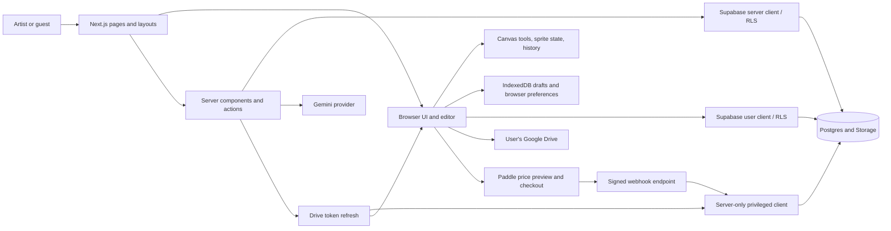

# Pigxel — product, technical specification, and requirements

**Document version:** 1.0  
**Codebase reviewed:** local workspace on October 3, 2026  
**Audience:** product owner, developers, designers, and QA  
**Scope:** all 26 page routes, all 23 registered editor tools, supporting features, data, integrations, and acceptance requirements.

This is a specification of the implementation present in the repository, including local changes. It is not a verification of the deployed service. “Implemented” means the relevant behavior exists in code; availability can still depend on configuration, migrations, browser capabilities, and external services. Acceptance criteria below are a reusable QA baseline, not a claim that every scenario has been tested.

Requirements with `PAGE`, `TOOL`, and `FR` identifiers describe the current product baseline. `GAP` items identify unfinished behavior or discrepancies. `NFR` items are proposed quality requirements unless explicitly described as implemented. This document does not silently turn promotional copy into a completed feature.

## Contents

1. [Product and terminology](#1-product-and-terminology)
2. [Users, access, and navigation](#2-users-access-and-navigation)
3. [Every page](#3-every-page)
4. [Every editor tool](#4-every-editor-tool)
5. [Editor features and menus](#5-editor-features-and-menus)
6. [Projects, storage, import, and export](#6-projects-storage-import-and-export)
7. [AI assistant](#7-ai-assistant)
8. [Community, assets, learning, and feedback](#8-community-assets-learning-and-feedback)
9. [Accounts, plans, and billing](#9-accounts-plans-and-billing)
10. [Technical architecture](#10-technical-architecture)
11. [Data model and access rules](#11-data-model-and-access-rules)
12. [Integrations and configuration](#12-integrations-and-configuration)
13. [Quality requirements and verification](#13-quality-requirements-and-verification)
14. [Known gaps and decisions](#14-known-gaps-and-decisions)
15. [Maintenance and source map](#15-maintenance-and-source-map)

## 1. Product and terminology

Pigxel is a browser-based pixel art workspace for drawing sprites, editing tiles, making frame animations, using an AI assistant, and keeping or sharing art. It combines an editor with a personal project library, artist profiles, a discovery gallery, reusable assets, and guided learning.

The main user journey is: create or open a project → draw or use AI → organize layers and frames → save → export or publish. All drawing tools are presented as free. Paid plans are presented as adding AI capacity, cloud space, and other benefits; several of those entitlements are not yet implemented (see Section 14).

| Term               | Meaning in Pigxel                                                                                                                                           |
| ------------------ | ----------------------------------------------------------------------------------------------------------------------------------------------------------- |
| Tile / project     | An editable document with dimensions, layers, frames, a palette, and optional slices. “Tile” is also used for artwork that is not a repeating terrain tile. |
| Sprite             | The artwork and its frame sequence inside a project.                                                                                                        |
| Layer              | A named component of the document; can be normal, background, group, or reference.                                                                          |
| Frame              | One animation time step with its own duration in milliseconds.                                                                                              |
| Cel                | The RGBA pixels for one layer in one frame.                                                                                                                 |
| Selection          | A pixel mask defining the area affected by an operation.                                                                                                    |
| Floating selection | Pixels temporarily lifted or pasted so the user can place and transform them before committing.                                                             |
| Palette            | An ordered list of colors saved with the document. Order matters for shading and indexed recoloring.                                                        |
| Slice              | A named rectangular region, optionally with a nine-patch center and pivot, used for export metadata and individual PNGs.                                    |
| Draft              | A per-user browser working copy, distinct from a cloud tile ID or Drive file ID.                                                                            |
| Published art      | A cloud tile made public by its owner. Its profile must also be public for other viewers to access it.                                                      |
| Asset              | A curated reusable project and preview sheet, managed by administrators.                                                                                    |
| AI credit          | The app's cost-based allowance unit. This is distinct from a model token.                                                                                   |

## 2. Users, access, and navigation

### 2.1 Roles

| Role             | Capabilities                                                                                                                                                                                                                         |
| ---------------- | ------------------------------------------------------------------------------------------------------------------------------------------------------------------------------------------------------------------------------------ |
| Guest            | Landing page, login/signup/recovery entry, Explore browsing and previews, pricing, welcome page, and legal pages. Protected pages send guests to login.                                                                              |
| Signed-in artist | Own projects and editor, settings, profiles, publish/unpublish own cloud art, pin art, follow artists, like published art, search, notifications, assets, tutorials, and feedback. AI and storage require their configured services. |
| Administrator    | Artist capabilities plus publishing, replacing, importing starter assets, and removing curated assets. The role comes from trusted Supabase `app_metadata.role === "admin"`.                                                         |

### 2.2 Shared app shell

**FR-NAV-01 — App navigation.** The signed-in shell supplies Home, My projects, Explore, Assets, and Tutorials links; a latest-release patch notes entry; account controls; search; notifications; and the current plan. Small screens have navigation controls appropriate to the narrower layout. Guests on public routes inside the app route group receive a public header.

**Acceptance:** navigation opens the correct URL; active items reflect the route; the account menu opens the user's profile, settings, pricing, feedback, and sign-out actions; the latest patch-note entry uses the first release in the data array.

**FR-NAV-02 — Search.** The search dialog combines browser draft results with server results for the user's cloud projects and discoverable artists. `@name` searches usernames by prefix; ordinary text searches project names, usernames, and display names. Server search caps input at 50 characters and returns up to six tiles and six artists. Results link to the editor or artist profile.

**Acceptance:** a local project is discoverable without a server project match; `@` searches do not return projects; private artists' information is subject to database access rules; queries containing SQL wildcard characters are treated literally.

**FR-NAV-03 — Notifications.** The notification bell currently represents new followers, rather than a general event system. It shows up to 20 follows, marks unread items using `profiles.notifications_seen_at`, and links to followers' profiles.

**Acceptance:** a follow after the seen timestamp increases unread count; marking the list seen advances that timestamp; missing data produces a usable empty state.

### 2.3 Authentication boundaries

The proxy refreshes Supabase cookies and protects `/home`, `/tiles`, `/settings`, `/profile`, `/patch-notes`, `/assets`, `/tutorials`, `/feedback`, `/u`, and `/auth/update-password`, including nested routes. Protected pages with data mutations also verify the user on the server. Signed-in visitors to `/` and `/login` are redirected to `/home`, except when the landing URL needs to process an auth callback.

**FR-AUTH-01 — Protected data.** A signed-out visitor must not gain editor, account, or private project access by entering a route directly. UI visibility is not the security boundary; server checks and row-level security are.

**FR-AUTH-02 — Safe redirects.** Auth continuation destinations must be local, allowlisted paths. The editor may retain a validated `id`; arbitrary external redirects and unsupported query parameters are discarded.

Sources: [route guards](../apps/web/src/lib/auth/routes.ts), [session checks](../apps/web/src/lib/auth/session.ts), [proxy](../apps/web/src/proxy.ts), [app shell](../apps/web/src/components/app-shell/app-shell.tsx).

## 3. Every page

Route group names such as `(app)`, `(editor)`, and `(public)` organize Next.js layouts and do not appear in the URL. Auth callback and API endpoints are documented separately in Section 12.

### 3.1 Complete route inventory

| ID      | URL                      | Page / purpose                                                              | Access                                        |
| ------- | ------------------------ | --------------------------------------------------------------------------- | --------------------------------------------- |
| PAGE-01 | `/`                      | Marketing landing page and interactive pixel playground                     | Guest; signed-in users normally redirect home |
| PAGE-02 | `/login`                 | Email/password login, signup, password recovery, and OAuth entry            | Guest; signed-in users redirect home          |
| PAGE-03 | `/auth/update-password`  | Set or change the authenticated user's password                             | Valid authenticated/recovery session          |
| PAGE-04 | `/home`                  | Dashboard, recent projects, creating shortcuts, learning, template previews | Signed in                                     |
| PAGE-05 | `/tiles`                 | My projects: browser drafts and cloud projects                              | Signed in                                     |
| PAGE-06 | `/tiles/new`             | Create a blank project or start from an asset/palette                       | Signed in                                     |
| PAGE-07 | `/tiles/edit`            | Full editor and AI workspace                                                | Signed in                                     |
| PAGE-08 | `/explore`               | Popular published art and animation previews                                | Guest or signed in; liking requires sign-in   |
| PAGE-09 | `/assets`                | Curated sprite/tile library and palettes                                    | Signed in; management requires admin          |
| PAGE-10 | `/tutorials`             | Tutorial catalog                                                            | Signed in                                     |
| PAGE-11 | `/tutorials/[slug]`      | Tutorial detail and practice launcher                                       | Signed in                                     |
| PAGE-12 | `/profile`               | Redirect to the user's artist profile                                       | Signed in                                     |
| PAGE-13 | `/u/[username]`          | Artist profile, pinned work, gallery, follows, activity                     | Signed in; private profiles restricted        |
| PAGE-14 | `/settings`              | Redirect to profile settings                                                | Signed in                                     |
| PAGE-15 | `/settings/profile`      | Avatar and profile details                                                  | Signed in                                     |
| PAGE-16 | `/settings/account`      | Email, password, OAuth connections, Drive, sign-out                         | Signed in                                     |
| PAGE-17 | `/settings/privacy`      | Public/private profile control                                              | Signed in                                     |
| PAGE-18 | `/settings/subscription` | Current plan and billing status                                             | Signed in                                     |
| PAGE-19 | `/pricing`               | Plan comparison, localized prices, subscription checkout                    | Guest or signed in                            |
| PAGE-20 | `/welcome`               | Post-checkout thank-you screen                                              | Public; not payment verification              |
| PAGE-21 | `/patch-notes`           | Versioned release notes                                                     | Signed in                                     |
| PAGE-22 | `/feedback`              | Bug/feature board with search, sorting, and voting                          | Signed in                                     |
| PAGE-23 | `/feedback/new`          | Submit a bug report or feature request                                      | Signed in                                     |
| PAGE-24 | `/terms`                 | Terms of Service                                                            | Public; current legal copy is a draft         |
| PAGE-25 | `/privacy`               | Privacy Policy                                                              | Public; current legal copy is a draft         |
| PAGE-26 | `/refunds`               | Refund Policy                                                               | Public; current legal copy is a draft         |

### 3.2 PAGE-01 — Landing (`/`)

**Purpose and behavior:** introduce Pigxel, show example artwork and Draw/Animate/AI/Export feature explanations, provide an interactive pixel playground, answer common questions, and direct visitors to signup, pricing, or Explore. A skip link supports reaching the main content. Demo art and promotional sections are not the user's project library.

**Requirements:** signup opens `/login?mode=signup`; login opens `/login`; pricing opens `/pricing`; Explore opens the public gallery. If the URL contains an auth `code`, forward it to `/auth/callback`; recovery callbacks retain the password-update destination. Auth errors forward to login.

**Acceptance:** guests can view the page without configured credentials; the playground responds to its controls; the app does not confuse demo drawings with saved projects; signed-in visits normally redirect home.

Source: [landing route](../apps/web/src/app/page.tsx), [landing UI](../apps/web/src/components/landing/landing.tsx).

### 3.3 PAGE-02 — Login, signup, and recovery (`/login`)

**Inputs:** `mode=signup`, `mode=forgot`, or default login; optional error state. Login/signup provide email and password forms and Google/Apple provider buttons. Forgot-password mode requests a reset email. Provider buttons become unavailable when their service configuration is missing.

**Requirements:** surface field and authentication errors; successful login/signup proceeds home; signup is designed for immediate sign-in with email confirmation disabled in Supabase configuration. Recovery requests produce useful status feedback. Google sign-in also connects the user's Drive when the required integration is configured.

**Acceptance:** incorrect credentials do not enter the app; signup behaves correctly with the documented Supabase configuration; a configured provider begins OAuth; an unconfigured provider does not imply it works; expired reset links show the recovery error state.

Source: [login route](../apps/web/src/app/login/page.tsx), [auth actions](../apps/web/src/app/login/actions.ts).

### 3.4 PAGE-03 — Update password (`/auth/update-password`)

**Behavior:** display a password form only after verifying the user. Used by reset-email recovery and by Account settings to change or add a password. Invalid sessions redirect to `/login?mode=forgot&error=expired`; absent Supabase configuration returns to recovery entry.

**Requirements and acceptance:** a valid user can submit a valid new password; validation errors remain on the form; successful update returns to Account settings with feedback; no user identity may be supplied by the client to change somebody else's password.

Source: [password route](../apps/web/src/app/auth/update-password/page.tsx), [password actions](../apps/web/src/app/auth/update-password/actions.ts).

### 3.5 PAGE-04 — Home (`/home`)

**Behavior:** show creating cards, up to four recent projects, tutorials, and illustrated template previews. Recent work combines browser and cloud data. The Blank canvas card opens creation. Generate with AI, Sprite animation, and Tileset shortcut cards are marked “Soon”; their underlying editor capabilities exist, but these dashboard launchers are not wired. Popular template previews are also marked “Soon.”

**Requirements and acceptance:** real recent projects open the correct draft; local/cloud representations of a project should not be mistaken for unrelated work; project actions give feedback; the empty state leads to creation; unavailable shortcuts must remain visibly unavailable.

Source: [home route](<../apps/web/src/app/(app)/home/page.tsx>), [home UI](../apps/web/src/components/home/home-view.tsx).

### 3.6 PAGE-05 — My projects (`/tiles`)

**Behavior:** separate browser working copies and cloud projects, with project thumbnails and project-card actions. Offer Create tile, loading/empty states, and additional cloud loading through the cloud list. Drive files are opened through the editor's Drive dialog rather than fetched as a full dashboard Drive inventory.

**Requirements and acceptance:** opening cloud work reuses an existing matching draft where possible; removing a browser copy affects local storage; deleting cloud work follows the cloud deletion flow; controls make their scope clear. A deletion must not remove another user's project.

Source: [projects route](<../apps/web/src/app/(app)/tiles/page.tsx>), [local projects](../apps/web/src/components/tiles/local-tiles.tsx), [cloud projects](../apps/web/src/components/tiles/cloud-tiles.tsx).

### 3.7 PAGE-06 — Create project (`/tiles/new`)

**Inputs:** name, width/height, background, and storage destination. Size presets are 16, 32, 64, and 128; supported dimensions are 1–256 per side. Defaults are “Untitled,” 32×32, transparent, and Pigxel cloud. Query parameters may select `asset`, `palette`, `from` (tab insertion context), or a Drive connection error.

**Behavior:** create a blank document or load an asset as the starting document; apply a selected palette where applicable; save to cloud, Drive, or only the browser; then open the draft in the editor. Drive choices depend on connection status.

**Requirements and acceptance:** reject invalid dimensions; preserve the loaded asset's valid document structure; give each project its own draft identity; failed browser persistence must show an actionable error, including whether remote saving already succeeded; successfully created work opens without replacing another draft.

Source: [creation route](<../apps/web/src/app/(app)/tiles/new/page.tsx>), [creation form](../apps/web/src/components/tiles/new-tile-form.tsx).

### 3.8 PAGE-07 — Editor (`/tiles/edit?id=…`)

**Inputs:** a browser draft ID, optional `guide` tutorial slug, and optional Drive error. The editor runs outside the standard app-shell layout. It contains File/Edit/Select/Tile/Layer/Frame/View/Window menus, project tabs, tool options, canvas, Tools, Colors, Palette, Assistant, Timeline, file status, and dialogs.

**Requirements:** load the appropriate local or remotely opened document; provide a missing-project state instead of silently substituting a blank tile; preserve document identity through edits; support tools and document operations described in Sections 4–7. Admin users may publish a project to Assets.

**Acceptance:** drawing, undo, tab switching, saving, import/export, layer/frame changes, AI errors, and guide overlays operate against the current project; locked/hidden layers do not receive invalid paint operations; a missing ID/draft produces the missing-tile UI.

Source: [editor route](<../apps/web/src/app/(editor)/tiles/edit/page.tsx>), [editor implementation](../apps/web/src/components/tile-editor/components/editor.tsx).

### 3.9 PAGE-08 — Explore (`/explore`)

**Inputs:** `period=week|month|year`, default week. Load published work with public profiles, 20 items per request, and popularity ranking based on likes in the selected period. Cards show artwork and artist context. Opening artwork loads the published document into a preview dialog, which supports animation playback when frames differ.

**Requirements and acceptance:** guests can browse and preview; signed-in users can like/unlike; a guest action requiring an account directs them toward login; period changes reset the feed; further loading preserves the period; private art and art from private profiles do not appear.

Source: [Explore route](<../apps/web/src/app/(app)/explore/page.tsx>), [public queries](../apps/web/src/lib/profile/server.ts), [preview](../apps/web/src/components/explore/popular-card/components/preview-dialog.tsx).

### 3.10 PAGE-09 — Assets (`/assets`)

**Inputs:** `type=all|characters|items|nature|tiles|palettes`, default all. “All” shows up to 12 assets per category; a category view loads up to 240. Palette entries come from the built-in palette catalog.

**Behavior:** inspect dimensions, colors, and animated previews; start a project from an asset; copy its first frame when supported; download its PNG sheet or `.pigxel` project. Palettes support starting a project, copying colors, downloading `.gpl`, and visiting their source catalog link. Admins can remove assets and bootstrap an empty library with the starter set.

**Requirements and acceptance:** categories use valid URL states; no-assets and load failures are handled; ordinary artists cannot manage the catalog; copied assets report unsupported clipboard access; an asset-based project gets a new identity rather than overwriting the catalog entry.

Source: [assets route](<../apps/web/src/app/(app)/assets/page.tsx>), [asset dialog](../apps/web/src/components/assets/asset-dialog.tsx).

### 3.11 PAGE-10 — Tutorials (`/tutorials`)

**Behavior:** show tutorial illustrations, title, summary, level, minutes, video status, and interactive step count. Current lessons: Pixel art basics (8 min), Your first animation (16 min), and Build a tileset (32 min).

**Requirements and acceptance:** every tutorial card links to its slug detail page; video availability follows actual `youtubeId` data; the current three tutorials must show “Video soon” because they have no configured video IDs.

Source: [tutorial catalog route](<../apps/web/src/app/(app)/tutorials/page.tsx>), [lesson definitions](../apps/web/src/lib/tutorials/tutorials.ts).

### 3.12 PAGE-11 — Tutorial detail (`/tutorials/[slug]`)

**Behavior:** resolve a known lesson, show its video or placeholder, description, practice project dimensions, ordered steps, and Start guide button. Unknown slugs return not found. Practice launches a browser-kept document and appends `guide=<slug>` to the editor URL.

**Requirements and acceptance:** guides target the right tools/menus/panels, automatically complete observable actions, and allow progression through informational steps. Missing optional assets must be handled. Starting practice must not replace existing work.

Source: [lesson route](<../apps/web/src/app/(app)/tutorials/[slug]/page.tsx>), [practice launcher](../apps/web/src/components/tutorials/start-guide-button.tsx), [guide coach](../apps/web/src/components/tile-editor/components/guide-coach.tsx).

### 3.13 PAGE-12 — Own profile redirect (`/profile`)

**Behavior and acceptance:** verify the user, fetch their profile, and redirect to `/u/<username>`. If no profile is available, redirect to `/settings/profile`. This is a shortcut route, not a separate gallery implementation.

Source: [own-profile route](<../apps/web/src/app/(app)/profile/page.tsx>).

### 3.14 PAGE-13 — Artist profile (`/u/[username]`)

**Behavior:** normalize the username; reject malformed or missing users with not found; distinguish a private profile from a nonexistent one. Visible profiles show avatar, display name, handle, bio, links, joining/premium context, follows, pinned art, gallery, and activity stats. Owners see their private cloud art and publishing controls; other viewers see published art. A private owner sees a privacy notice.

**Requirements and acceptance:** owners can publish/unpublish and pin/unpin cloud art, with at most four pins; other signed-in artists can follow/unfollow public profiles; self-follow is rejected; local-only and Drive-only files are not automatically listed as profile art. Making a profile private removes its work from public discovery.

Source: [artist route](<../apps/web/src/app/(app)/u/[username]/page.tsx>), [profile actions](<../apps/web/src/app/(app)/u/[username]/actions.ts>).

### 3.15 PAGE-14 — Settings redirect (`/settings`)

**Behavior and acceptance:** redirect to `/settings/profile` inside the authenticated settings area. Shared tabs expose Profile, Account, Subscription, and Privacy.

Source: [settings redirect](<../apps/web/src/app/(app)/settings/page.tsx>), [settings layout](<../apps/web/src/app/(app)/settings/layout.tsx>).

### 3.16 PAGE-15 — Profile settings (`/settings/profile`)

**Behavior:** choose/remove/upload an avatar or use a provider avatar; edit username, display name, bio, and up to three links; open the profile. Missing profile/migration state shows an explanatory notice.

**Requirements and acceptance:** usernames are normalized, unique, 3–20 lowercase letters/digits/underscores, with reserved names rejected; display names are 1–50 characters; bios ≤200; links are validated HTTPS URLs with optional labels ≤40 characters; maximum three links. Successful edits update the user's own profile only.

Source: [profile settings](<../apps/web/src/app/(app)/settings/profile/page.tsx>), [validation](../apps/web/src/lib/profile/validation.ts).

### 3.17 PAGE-16 — Account settings (`/settings/account`)

**Behavior:** show current email and pending email changes; change email; link to changing/adding a password; connect/unlink Google or Apple identities; connect/disconnect Drive; sign out. The UI prevents unlinking the only identity. Drive connection is distinct from whether a Google sign-in identity exists.

**Requirements and acceptance:** last-identity unlink is blocked; pending email change is explained; a failed provider link/Drive connection shows status; disconnecting Drive removes/revokes the connection while leaving the user's actual Drive files in place; sign-out ends the session on this device.

Source: [account settings](<../apps/web/src/app/(app)/settings/account/page.tsx>), [account actions](<../apps/web/src/app/(app)/settings/account/actions.ts>).

### 3.18 PAGE-17 — Privacy settings (`/settings/privacy`)

**Behavior:** choose public or private profile visibility. Artwork remains independently private until published.

**Requirements and acceptance:** only the current user's profile is changed; a private profile is visible to its owner and unavailable to other viewers; publishing a tile does not bypass the profile's private status.

Source: [privacy settings](<../apps/web/src/app/(app)/settings/privacy/page.tsx>).

### 3.19 PAGE-18 — Subscription settings (`/settings/subscription`)

**Behavior:** show Free or a paid tier, monthly/yearly cycle, past-due state, scheduled cancellation, or renewal date. Link to pricing and refund policy. The page explicitly says plan/payment changes and invoices are coming later.

**Requirements and acceptance:** derive the plan from stored subscription events and recognized price IDs; Free is the fallback; canceled/paused records do not grant an active paid tier. Do not describe this page as an implemented billing-management portal.

Source: [subscription settings](<../apps/web/src/app/(app)/settings/subscription/page.tsx>), [plan resolution](../apps/web/src/lib/billing/subscription.ts).

### 3.20 PAGE-19 — Pricing (`/pricing`)

**Behavior:** compare Free, Starter, Pro, and Advanced; switch monthly/yearly; fetch localized prices using Paddle; show annual savings when comparable quotes justify them; open a one-page Paddle overlay checkout for configured paid prices. Signed-in checkout carries user ID/email; completed checkout returns to `/welcome`.

**Requirements and acceptance:** missing Paddle setup surfaces an unavailable/error state rather than fabricated pricing; currency comparisons use like currencies; checkout has the appropriate environment and price; user attribution is supplied for signed-in purchases. Paid-tier marketing must be evaluated against the entitlement gaps in Section 14.

Source: [pricing route](<../apps/web/src/app/(app)/pricing/page.tsx>), [checkout UI](../apps/web/src/components/pricing/pricing-plans.tsx), [tier definitions](../apps/web/src/lib/pricing.ts).

### 3.21 PAGE-20 — Welcome (`/welcome`)

**Behavior:** a thank-you message after checkout and a Start creating link to `/home`. Search indexing is disabled for the page.

**Requirements and acceptance:** the page is a navigation destination, not proof of payment. Visiting it directly must not grant a subscription. Only valid billing events update the subscription record; home still requires an account.

Source: [welcome route](<../apps/web/src/app/(app)/welcome/page.tsx>).

### 3.22 PAGE-21 — Patch notes (`/patch-notes`)

**Inputs:** optional `v=<version>`. Show one release, defaulting to the newest or falling back to it for an unknown version. The current design uses a release poster, pixel garden illustration, release/date/latest badges, numbered feature cards, chapter/change counts, a details anchor, and a creation link.

**Requirements and acceptance:** the selector changes the URL; release content comes from `PATCH_NOTES`; newest-first ordering controls both the page default and sidebar announcement; date formatting uses UTC to avoid date shifts; unknown versions do not crash.

Source: [patch-notes route](<../apps/web/src/app/(app)/patch-notes/page.tsx>), [release data](../apps/web/src/lib/patch-notes.ts).

### 3.23 PAGE-22 — Feedback board (`/feedback`)

**Inputs:** `kind=bug|feature` (default feature), `state=open|closed` (default open), `sort=votes|newest` (default votes), `q` for title search, and optional `from` page context for submission links. Show up to 50 items with title, description, status, votes, author context, and age.

**Requirements and acceptance:** kind/state/search/sort compose correctly; statuses map to the proper bucket; voting updates feedback and handles errors; closed items do not expose active voting; title search is capped at 100 characters and escapes wildcard characters. There is no dedicated feedback-detail page or implemented moderation UI.

Source: [board route](<../apps/web/src/app/(app)/feedback/page.tsx>), [board queries](../apps/web/src/lib/feedback/server.ts).

### 3.24 PAGE-23 — New feedback (`/feedback/new`)

**Inputs:** `kind`, optional `from`, title, description. Submission stores the originating path, user agent, and latest patch-note version as diagnostic context. Enforce at most three `open` items per kind per user; approved or in-development items do not count toward this particular limit.

**Requirements and acceptance:** title is 1–100 characters, description 1–300; valid creation redirects to the corresponding newest-sorted board; preserve input on errors; enforce the limit in server logic and a database trigger; do not expose diagnostic metadata through ordinary board-select privileges.

Source: [submission route](<../apps/web/src/app/(app)/feedback/new/page.tsx>), [feedback actions](<../apps/web/src/app/(app)/feedback/actions.ts>).

### 3.25 PAGE-24 — Terms (`/terms`)

**Behavior:** display account conditions, art ownership, AI conditions, prohibited use, plans/payments, third-party services, availability, account termination, disclaimers, governing-law text, and contact information.

**Requirements and acceptance:** shared legal metadata supplies date/operator/contact information. The current file contains placeholders and `draft: true`; it must not be treated as finalized business/legal requirements. Policy descriptions of cancellation are ahead of the implemented settings UI.

Source: [terms route](<../apps/web/src/app/(public)/terms/page.tsx>), [legal configuration](../apps/web/src/lib/legal.ts).

### 3.26 PAGE-25 — Privacy (`/privacy`)

**Behavior:** explain the app's declared collection/use/sharing/retention of account data, art, AI processing, third-party services, cookies, rights, international transfers, children, and contact details.

**Requirements and acceptance:** access without sign-in; render from the shared legal layout and draft metadata. Statements about service behavior must be reconciled with implementation before policy publication; this source review does not verify compliance or deployed infrastructure.

Source: [privacy route](<../apps/web/src/app/(public)/privacy/page.tsx>).

### 3.27 PAGE-26 — Refunds (`/refunds`)

**Behavior:** describe a configurable refund window (currently 14 days), asking Paddle or the operator for a refund, payment-method return, plan implications, and cancellation.

**Requirements and acceptance:** access without sign-in; use the shared refund-days value and operator contact fields. The page is policy content, not an automated refund/cancellation flow; no entitlement is changed merely by viewing it.

Source: [refund route](<../apps/web/src/app/(public)/refunds/page.tsx>).

## 4. Every editor tool

Tools are registered centrally and grouped into Select, Move, Draw, Lines & shapes, Fill, Effects, Text & slices, and Pick colour. Each definition supplies its ID, label, shortcut, cursor/tip, option controls, hints, and canvas handlers. Toolbar customization can hide tools; the registry remains the source of shortcut definitions.

### 4.1 Tool catalog and acceptance requirements

All 23 entries below exist in the registry. A tool's acceptance criterion is in addition to the common editing constraints in Section 4.2.

| Requirement | Tool / ID                               | Shortcut  | Behavior and options                                                                                                                             | Acceptance criterion                                                                                                                            |
| ----------- | --------------------------------------- | --------- | ------------------------------------------------------------------------------------------------------------------------------------------------ | ----------------------------------------------------------------------------------------------------------------------------------------------- |
| TOOL-01     | Rectangle selection / `marquee`         | `M`       | Drag a rectangular mask; selection actions include flips, rotation, picture brush, and deselect.                                                 | Only the intended rectangle is selected; modifier operations combine masks correctly.                                                           |
| TOOL-02     | Elliptical selection / `ellipseMarquee` | `Shift+M` | Drag an ellipse; Shift while dragging constrains a circle.                                                                                       | The mask follows the ellipse rather than selecting its entire bounding box.                                                                     |
| TOOL-03     | Lasso / `lasso`                         | `Q`       | Draw a freehand region around pixels.                                                                                                            | Closing a path produces a usable pixel mask with add/subtract behavior.                                                                         |
| TOOL-04     | Polygonal lasso / `polygonLasso`        | `Shift+Q` | Click corners; first point, double-click, or Enter closes; Esc cancels; Shift adds and Alt subtracts.                                            | Polygon interior becomes the selection; cancel leaves no partial committed polygon.                                                             |
| TOOL-05     | Magic wand / `wand`                     | `W`       | Select matching colors with contiguous toggle and tolerance 0–255.                                                                               | Contiguous selects the connected area; off selects matching pixels across the sampled image; modifiers combine masks.                           |
| TOOL-06     | Move / `move`                           | `V`       | Move the selection or whole active layer; handles scale, rotation knob turns; transform fields; arrows nudge; Enter commits; Esc cancels.        | Commit places transformed pixels; cancel restores the pre-transform result; layer protections remain respected.                                 |
| TOOL-07     | Pen / `pen`                             | `B`       | Square-tip freehand drawing; size, pixel-perfect, ink, opacity, dither, and optional picture brush.                                              | A 1 px pixel-perfect stroke removes extra corner pixels; larger tips disable that option; secondary-button painting uses secondary color.       |
| TOOL-08     | Brush / `brush`                         | `N`       | Round or angled line brush; brush size/shape/angle, ink, opacity, dither, picture brush.                                                         | Brush shape and angle change the footprint; stamped artwork retains its actual pixel colors.                                                    |
| TOOL-09     | Spray / `spray`                         | `Shift+S` | Hold to scatter dots; width, speed 1–100, ink, opacity, dither.                                                                                  | Longer holds increase density; dots remain inside supported paint bounds; release ends spraying.                                                |
| TOOL-10     | Eraser / `eraser`                       | `E`       | Square eraser with size and dither; Shift+click erases a line; Alt samples.                                                                      | Erasing reveals underlying/background content; background-layer handling follows the document background rather than producing an invalid hole. |
| TOOL-11     | Line / `line`                           | `L`       | Drag endpoints; size and dither; Shift snaps to 45° increments.                                                                                  | Final line joins the endpoints with the selected thickness and valid snap direction.                                                            |
| TOOL-12     | Curve / `curve`                         | `Shift+L` | Drag ends, then bend near and far portions; size, pixel-perfect, dither; Enter keeps; Esc cancels.                                               | Multi-stage editing produces a curve, not prematurely committed line segments; cancel removes the pending stroke.                               |
| TOOL-13     | Rectangle / `rect`                      | `U`       | Outline or filled rectangle; thickness and dither; Shift constrains a square.                                                                    | Filled/outline options produce distinct results; square constraint preserves equal sides.                                                       |
| TOOL-14     | Ellipse / `ellipse`                     | `Shift+U` | Outline or filled ellipse; thickness and dither; Shift constrains a circle.                                                                      | Shape fits its bounds and honors fill, thickness, and circle constraint.                                                                        |
| TOOL-15     | Contour / `contour`                     | `D`       | Freehand contour that closes and fills while drawing; ink/opacity/dither.                                                                        | The drawn contour produces the intended filled region and one committed edit.                                                                   |
| TOOL-16     | Polygon / `polygon`                     | `Shift+D` | Click vertices; close with first point/double-click/Enter; Shift snaps; Esc cancels; filled with ink/dither.                                     | Only a completed polygon is committed; right button uses secondary color.                                                                       |
| TOOL-17     | Paint bucket / `bucket`                 | `G`       | Fill matching pixels; contiguous, tolerance, dither, and sampling from active layer or all visible layers.                                       | Sampling all layers identifies the region while writing to the active editable layer; selection limits writes.                                  |
| TOOL-18     | Gradient / `gradient`                   | `Shift+G` | Drag primary→secondary across selection or whole layer; linear/radial; ordered 4×4 or 8×8 dither, or smooth; Shift snaps; right button reverses. | Ordered modes retain the two endpoint colors; smooth may mix new shades; fill is limited to its intended area.                                  |
| TOOL-19     | Blur / `blur`                           | `R`       | Round effect brush; size and dither; repeated strokes soften by introducing intermediate colors.                                                 | A stroke changes nearby pixels locally; repeated strokes increase blur without altering unrelated regions.                                      |
| TOOL-20     | Jumble / `jumble`                       | `Shift+R` | Round effect brush; size and dither; scatters existing pixels for ragged texture.                                                                | Uses existing colors rather than synthesizing blended shades; operation remains local.                                                          |
| TOOL-21     | Text / `text`                           | `T`       | Click, type, choose pixel font/scale; Enter rasterizes to a floating placement; Esc cancels; right-click uses secondary.                         | Text is rasterized at the selected scale, can be placed, and persists as pixels in the project.                                                 |
| TOOL-22     | Slice / `slice`                         | `C`       | Drag a named region; select/move/edit/delete it; bounds, nine-patch center, pivot; individual PNG export.                                        | Slice metadata is saved and exported; Delete removes the selected slice rather than clearing paint when slice handling applies.                 |
| TOOL-23     | Pipette / `pipette`                     | `I`       | Sample the primary color with click or secondary with right-click; works on nonpaintable layers too.                                             | Sampling updates the correct color slot; transparent pixels do not manufacture an opaque color.                                                 |

Source: [tool registry](../apps/web/src/components/tile-editor/tools/index.ts). Each tool's implementation is under `apps/web/src/components/tile-editor/tools/<tool-directory>/`.

### 4.2 Common tool requirements

- **FR-EDIT-01 — Write boundary:** paint writes are clipped to valid document pixels and the active selection; symmetry and tiled modes intentionally alter how coordinates are repeated/wrapped.
- **FR-EDIT-02 — Layer protection:** painting requires an editable layer. A locked/hidden layer or group must not receive ordinary drawing. Selection, pipette, and slice tools can operate in their permitted nonpaint contexts.
- **FR-EDIT-03 — Color slots:** primary/secondary colors support left/right painting; `X` swaps them. Alt sampling is available on supported drawing tools. Shift+click joins strokes for supported freehand tools.
- **FR-EDIT-04 — History:** a completed change is undoable/redoable; unfinished multi-step gestures can be canceled without leaving pixels behind. Undo history is capped at 100 states in the current editor.
- **FR-EDIT-05 — UI focus:** keyboard tool/command handling avoids hijacking text fields; shortcuts use Ctrl on Windows/Linux and Command on macOS where a modifier is needed. Some file shortcuts are deliberately handled even when a field has focus.

### 4.3 Shared paint options

| Option            | Meaning / current values                                                                                                   |
| ----------------- | -------------------------------------------------------------------------------------------------------------------------- |
| Size              | Tool-specific size field clamped to 1–16; pen, brush, eraser, and spray width use different state keys.                    |
| Pixel-perfect     | Removes unnecessary corner pixels from 1 px strokes; unavailable when the pen size is above 1.                             |
| Simple ink        | Paints selected color with its intended transparency and compositing behavior.                                             |
| Alpha compositing | Layers translucent color over existing pixels; repeated strokes accumulate.                                                |
| Copy color        | Writes the selected RGBA value directly, including transparency.                                                           |
| Lock alpha        | Changes color only where content exists while preserving its alpha.                                                        |
| Shading           | Moves pixels one step forward/back through the ordered palette with primary/secondary button.                              |
| Opacity           | 0–255 for supported non-shading ink modes.                                                                                 |
| Dither density    | Solid (100%), 75%, 50%, or 25%; exposed only by tools supporting it.                                                       |
| Contiguous        | Connected region only when on; all matching pixels when off.                                                               |
| Tolerance         | 0–255; maximum permitted per-channel difference, including alpha.                                                          |
| Fill from         | Active layer or all layers for bucket sampling.                                                                            |
| Picture brush     | A selected pixel region used as the Pen/Brush footprint. Normal size/ink controls may be replaced while a stamp is active. |

Text fonts: Tiny5, DotGothic16, Press Start 2P, Silkscreen, and Tiny 3×5. Scales: 1×, 2×, 3×. The font catalog documents Latin/Cyrillic support for the first three and Latin-only constraints for the smaller alternatives.

Sources: [shared options](../apps/web/src/components/tile-editor/tools/shared/options.tsx), [pen settings](../apps/web/src/components/pixel-canvas/pen.ts), [text fonts](../apps/web/src/components/pixel-canvas/text-fonts.ts).

## 5. Editor features and menus

### 5.1 Menu specification

| Menu   | Features                                                                                                                                                 | Requirement / expected behavior                                                                                                                               |
| ------ | -------------------------------------------------------------------------------------------------------------------------------------------------------- | ------------------------------------------------------------------------------------------------------------------------------------------------------------- |
| File   | New tile; open computer/cloud/Drive; import pictures as frames or sprite sheet; save to cloud/Drive; download `.pigxel`; export; admin Publish to Assets | FR-FILE-01: preserve document data and clarify source/destination; gate unavailable Drive/admin actions.                                                      |
| Edit   | Undo/redo; cut/copy/paste/delete; insert asset; selection flips/90° rotation; fill/stroke/outline/replace color; use selection as brush/reset brush      | FR-EDIT-06: effects write to the editable target and honor selection boundaries where applicable; clipboard failure is handled.                               |
| Select | Select all, deselect, invert, reselect; expand/contract/border; save/load selection                                                                      | FR-SELECT-01: operations modify masks correctly; unavailable operations are disabled. Saved selections are editor state, not a field of the `.pigxel` format. |
| Tile   | Canvas size; sprite size; crop to selection; trim empty edges; rotate 90°/180°; flip; RGB/indexed/grayscale; pixel ratio                                 | FR-DOC-01: document operations consistently transform relevant cels, dimensions, and slice metadata.                                                          |
| Layer  | New layer/group/reference; rename/show/hide/lock/unlock; clear active frame; move out of group; delete                                                   | FR-LAYER-01: preserve layer hierarchy and per-frame data; prevent invalid last-layer/background operations.                                                   |
| Frame  | Empty/duplicate frame; play/pause; previous/next; move left/right; delete                                                                                | FR-FRAME-01: frame order, cels, and durations remain aligned; keep at least one frame.                                                                        |
| View   | Onion skin and 1/2/3 frames each way; pixel grid; major 8/16/32 grid; horizontal/vertical/both mirror; horizontal/vertical/both tiled mode               | FR-VIEW-01: view state is distinguishable from destructive document edits; grids/onion overlays do not enter export.                                          |
| Window | Show/hide Tools, Colors, Palette, Assistant, Timeline; customize tools; reset layout                                                                     | FR-LAYOUT-01: panels can be moved/resized/collapsed/hidden and restored without losing document contents.                                                     |

Sources: [editor menus](../apps/web/src/components/tile-editor/components/editor.tsx), [File menu](../apps/web/src/components/tile-editor/components/editor-header.tsx), [layer/frame actions](../apps/web/src/components/timeline/actions.ts).

### 5.2 Colors and palette

**FR-COLOR-01:** provide primary and secondary color slots, picker controls, recent colors, and color swapping. Keep per-user pen preferences locally.

**FR-COLOR-02:** each project saves an ordered palette with at most 256 colors. Allow choosing, adding/removing primary color, double-click editing swatches, reordering by drag, loading presets, extracting current-frame colors, importing palette/image files, and saving `.gpl`.

**FR-COLOR-03:** palette import accepts GIMP `.gpl`, hex lists `.hex`, and Paint.NET-style text `.txt`; image import extracts colors. The implemented editor export is `.gpl`, despite older release wording implying exports in every imported format.

**FR-COLOR-04:** RGB preserves arbitrary RGBA. Grayscale converts using luminance weighting while retaining alpha. Indexed mode maps colors to the palette and converts alpha to transparent/opaque using a 128 threshold. Editing/replacing the palette in indexed mode can recolor the artwork according to palette positions.

**Acceptance:** a palette survives save/open; invalid palettes produce an error; indexed results use allowed colors; replacing palette colors does not silently behave like ordinary RGB swatch editing.

Current 14 presets: PICO-8, Sweetie 16, Endesga 32, Game Boy, Kirokaze Game Boy, Hollow, Twilight 5, Oil 6, SLSO8, Ammo-8, Nyx8, Commodore 64, Apollo, and Resurrect 64.

Sources: [palette panel](../apps/web/src/components/tile-editor/components/colors/palette-panel.tsx), [palette presets](../apps/web/src/lib/palette/presets.ts), [color modes](../apps/web/src/lib/palette/color-mode.ts).

### 5.3 Selections and transforms

**FR-SELECT-02:** support mask creation, add/subtract, inversion, reselect, expanding/contracting/bordering, and storing/loading a saved mask. Support cut/copy/paste inside Pigxel and image clipboard interoperability when the browser permits it.

**FR-SELECT-03:** a floating region can move, scale, rotate, flip, and nudge before placement. Enter commits; Esc cancels pending interactions according to the active operation. Whole-layer movement is available through Move without manually selecting every pixel.

**FR-SELECT-04:** filling, stroking, outlining, and replacing color must work at the intended scope. Use selection as brush preserves selected pixels for repeated stamps. Paste and inserted assets enter a placement state instead of irrevocably overwriting the destination immediately.

**Acceptance:** cancel is reversible; copied/pasted pixels preserve transparency; mask modification does not affect unrelated pixels; a selection transformed at the tile edge stays within valid edit behavior.

Sources: [selection engine](../apps/web/src/components/pixel-canvas/use-selection.ts), [free transform](../apps/web/src/components/pixel-canvas/free-transform.ts), [selection effects](../apps/web/src/components/pixel-canvas/effects.ts).

### 5.4 Layers and compositing

**FR-LAYER-02:** normal layers contain artwork; background layers provide the configured solid background; groups contain nested layers; reference layers support visual reference without appearing in standard exports. Users can select, rename, reorder, group, show/hide, lock/unlock, and remove layers using timeline controls and menus.

**FR-LAYER-03:** opacity ranges 0–255. Supported blend modes: Normal, Multiply, Screen, Overlay, Darken, Lighten, Color Dodge, Color Burn, Hard Light, Soft Light, Difference, Exclusion, Hue, Saturation, Color, Luminosity, Addition, Subtract, and Divide.

**Acceptance:** layer tree and group state survive serialization; visible layer order determines compositing; hidden layers do not appear; reference layers are excluded from standard export/thumbnail flattening; editing one cel does not modify every frame.

Sources: [layer model](../apps/web/src/lib/layers/types.ts), [compositor](../apps/web/src/lib/layers/composite.ts), [blend modes](../apps/web/src/lib/layers/constants.ts).

### 5.5 Frames, timeline, and animation

**FR-FRAME-02:** frames have stable IDs and independent duration. Default duration is 100 ms; valid duration is 1–65,535 ms. Users can create empty or duplicated frames, reorder, delete, select cells, step frames, and play/pause a loop. A document retains at least one frame.

**FR-FRAME-03:** onion skin displays neighboring frames, 1–3 in each direction, with different treatment for before/after and lower strength at greater distance. Onion skin, selection overlays, grids, and playback UI do not become saved artwork.

**Acceptance:** duplicating retains the previous frame's content; changing one frame does not change a separate cel unintentionally; playback uses each duration; GIF/sheet exports preserve frame order. The AI's 12-frame limit is not a general manual-document frame limit.

Sources: [timeline](../apps/web/src/components/timeline/timeline.tsx), [frames](../apps/web/src/lib/sprite/frames.ts), [playback](../apps/web/src/components/timeline/use-playback.ts).

### 5.6 Canvas, document size, and view

**FR-DOC-02:** Canvas size adds/removes space without scaling pixels; provide anchor and border controls. Sprite size rescales all relevant artwork using Nearest neighbour, Bilinear, or RotSprite. Crop to selection changes the document extent; Trim empty edges uses drawn bounds. Whole-document rotations/flips transform the appropriate cels and slice data.

**FR-VIEW-02:** support zoom, mouse/trackpad/pinch navigation, middle-button or Space-drag panning, checkerboard transparency, pixel grid, and major grid. The current canvas scale range is 2–48, with default 16 and zoom factor 1.15; these are display-scale settings, not supported project dimensions.

**FR-VIEW-03:** pixel ratios are square 1:1, wide 2:1, and tall 1:2. They affect display and optionally export; they do not increase the logical pixel dimensions recorded in the document.

**Acceptance:** zoom/pan do not alter pixel data; resizing to 1×1 or 256×256 follows limits; nearest-neighbor export remains sharp; clipping/resizing keeps slices consistent with the new canvas.

Sources: [canvas size](../apps/web/src/lib/sprite/canvas-size.ts), [sprite scaling](../apps/web/src/lib/sprite/sprite-size.ts), [view settings](../apps/web/src/components/pixel-canvas/view.ts).

### 5.7 Layout and project tabs

**FR-LAYOUT-02:** five panels can occupy left/right/bottom/inner docks, be rearranged relative to each other, resized, collapsed, or hidden. Tool visibility and last-used group selections are customizable. Layout/preferences persist per user in browser storage; reset restores the default arrangement.

**FR-TABS-01:** multiple projects can be kept as editor tabs, with thumbnail, name, destination, active/dirty state, drag reordering, close/middle-click close, and a new-project control. Switching restores the matching project. Closing a tab forgets that editor instance but does not itself delete the saved project/draft; current UI only exposes tab close when more than one tab is present.

**Acceptance:** closing/switching/reordering tabs never replaces a different project's data; saved tab order restores for the user; a missing draft is not resurrected as unrelated art.

Sources: [dock model](../apps/web/src/lib/editor-layout/layout.ts), [tabs UI](../apps/web/src/components/tile-editor/components/tile-tabs.tsx), [kept editor instances](../apps/web/src/components/tile-editor/kept-tiles.ts).

### 5.8 Keyboard reference

`Mod` means Command on macOS and Ctrl on Windows/Linux. Tool shortcuts are in Section 4.

| Shortcut                          | Action                                                                       |
| --------------------------------- | ---------------------------------------------------------------------------- |
| `Mod+S`, `Mod+O`, `Mod+E`         | Save to current destination/download; open computer file; export             |
| `Mod+Z`, `Mod+Shift+Z` or `Mod+Y` | Undo; redo                                                                   |
| `Mod+X`, `Mod+C`, `Mod+V`         | Cut, copy, paste (paste is handled through clipboard events)                 |
| `Mod+A`, `Mod+D`                  | Select all; deselect                                                         |
| `Mod+Shift+D`, `Mod+Shift+I`      | Reselect; invert selection                                                   |
| `Shift+H`, `Shift+V`              | Flip selected/transform target horizontally/vertically                       |
| `Shift+N`, `Alt+N`                | New layer; duplicate frame                                                   |
| `Alt+↑`, `Alt+↓`                  | Select neighboring layer                                                     |
| `,`, `.`                          | Previous/next frame                                                          |
| `[` / `]`                         | Smaller/larger supported tool tip                                            |
| `X`                               | Swap primary and secondary colors                                            |
| `F3`                              | Toggle onion skin                                                            |
| `+`, `−`, `Mod+0`                 | Zoom in/out; reset zoom                                                      |
| Arrow keys                        | Nudge selection/transform target                                             |
| `Enter`, `Esc`                    | Commit placement / cancel or deselect, depending on active interaction       |
| `Delete` / `Backspace`            | Clear applicable selected pixels/cel; slice tool has slice deletion handling |
| Space-drag / middle-button drag   | Pan canvas                                                                   |

Source: [shortcut resolver](../apps/web/src/components/tile-editor/helpers.ts).

## 6. Projects, storage, import, and export

### 6.1 Storage model

| Location      | Implementation                                                                                      | User experience / limitation                                                                                          |
| ------------- | --------------------------------------------------------------------------------------------------- | --------------------------------------------------------------------------------------------------------------------- |
| Browser draft | Per-user draft store; IndexedDB preferred, localStorage fallback/migration; cross-tab notifications | Fast working copy survives navigation/reload; device/site-data dependent; not guaranteed backup or multi-device sync. |
| Pigxel cloud  | Private Supabase `tiles` bucket plus metadata row                                                   | Account storage and autosave; profile publication and discovery originate here.                                       |
| Google Drive  | Browser talks to Drive with a server-refreshed user token; `.pigxel` files                          | Autosave and opening of Pigxel-created accessible files; limited by `drive.file` scope.                               |
| Download      | Browser file download                                                                               | Portable `.pigxel` snapshot; no ongoing filesystem autosave relationship.                                             |

**FR-SAVE-01:** each new/opened project owns an independent per-user draft with serialized document, name, remote location if any, dirty flag, and save timestamp. Opening an already represented cloud/Drive project can reuse its draft. The editor URL `id` normally identifies the draft, not the remote file directly.

**FR-SAVE-02:** debounce remote autosave by 1,500 ms after changes. Track saving/saved/failed states and the revision being saved so a completed older request does not mark newer edits clean. Browser-only Save downloads the document; cloud/Drive Save targets the linked destination.

**FR-SAVE-03:** let the user save/move the active project's destination to cloud or Drive, with file status feedback. A destination change must not be described as guaranteed deletion of the old remote copy; the save routine does not establish such a guarantee.

**Acceptance:** disconnect/network failure retains the working draft and shows save failure; newer revisions remain dirty while an older save completes; clearing site data removes local-only availability; one user's drafts are not loaded as another user's projects.

Sources: [draft store](../apps/web/src/lib/pigxel-file/draft.ts), [save lifecycle](../apps/web/src/components/tile-editor/use-tile-file.ts), [open/reuse draft](../apps/web/src/lib/pigxel-file/open-tile.ts).

### 6.2 `.pigxel` document format

**FR-FORMAT-01:** write JSON with `format: "pigxel"`, current format `version: 6`, document ID, width/height/background, frames, nested layers, cels, palette, slices, optional color mode, and optional non-square pixel ratio. Cels store base64 DEFLATE-compressed RGBA arrays. Missing frame-layer cells are represented through the cel model rather than requiring a full array for every possible pair.

**FR-FORMAT-02:** retain compatibility with older supported versions: early formats stored layer pixels directly; versions 3+ use frame/cel structure; versions 4+ use compressed pixel data. Reject newer versions, wrong format, damaged pixel lengths, invalid sizes, and documents without valid pixel layers. Normalize supported/default values during load.

**Acceptance:** round-trip a document with nested groups, hidden/reference layers, variable-duration frames, palette, slices, indexed mode, and non-square ratio; expected rendered output and metadata match; invalid files produce understandable errors.

Source: [format/parser](../apps/web/src/lib/pigxel-file/format.ts).

### 6.3 Import and opening

**FR-IMPORT-01:** open `.pigxel` from computer, cloud, or Drive. Recognize supported image files (PNG, GIF, JPEG, WebP, BMP) and decode to a document. Browser decoding support still applies. Animated GIFs supply frames and timing; exact enlarged pixel grids can be recovered before fitting oversized work into supported tile bounds.

**FR-IMPORT-02:** import multiple pictures as frames with natural filename ordering, accommodating differing sizes in a common frame extent. Sprite-sheet import supplies adjustable frame size, offsets, gaps, ordering, and grid preview/detection so sheet cells become frames.

**FR-IMPORT-03:** support dropping files into the editor; multiple images can be confirmed as a new animation. Clipboard images can enter a floating selection. Reference-layer creation imports a picture as a non-exported reference. Asset insertion brings the asset's first frame into a movable selection on the active layer; starting a new project from the asset can retain its document animation.

**Acceptance:** invalid files do not replace current work; natural ordering handles `frame2` before `frame10`; sheet slicing follows selected geometry; opening creates/reuses the right draft/tab; newly imported artwork honors dimensions and frame timing.

Sources: [image import](../apps/web/src/lib/pigxel-file/import-image.ts), [sheet import](../apps/web/src/lib/pigxel-file/import-sheet.ts), [sheet dialog](../apps/web/src/components/tile-editor/components/import-sheet-dialog.tsx).

### 6.4 Export

| Format           | Exported content                     | Important behavior                                                                                                                 |
| ---------------- | ------------------------------------ | ---------------------------------------------------------------------------------------------------------------------------------- |
| PNG              | Current flattened frame              | Supports transparency; integer scaling keeps pixels sharp.                                                                         |
| JPEG             | Current flattened frame              | Solid configured background, white fallback for transparency; lossy compression can soften pixels.                                 |
| GIF              | All frames as looping animation      | Frame timings converted to GIF delays; alpha threshold 128; 255 opaque colors plus transparency; minimum delay 2 centiseconds.     |
| Sprite sheet PNG | All frames in a row, column, or grid | Optional Aseprite-style JSON frame metadata, durations, slice centers/pivots; current `frameTags`/layer metadata arrays are empty. |
| Slice PNGs       | Each slice of the current frame      | Separate PNG named from each slice; slice export requires slices.                                                                  |

**FR-EXPORT-01:** offer 1–20× integer scale, layout when relevant, optional sheet JSON, and optional application of pixel ratio. Cap resulting image sides at 16,384 pixels. Exclude hidden and reference layers; composite visible normal/background layers using their settings. No editor guides/grid/selection decorations enter the export.

**Acceptance:** verify dimensions, alpha, frame count/order/timing, compositing, ratio behavior, and metadata positions; export an empty/reference-only configuration predictably; disallow unsupported output sizes without losing the project.

Sources: [export settings](../apps/web/src/lib/export/constants.ts), [export engine](../apps/web/src/lib/export/export.ts), [sheet metadata](../apps/web/src/lib/export/sheet.ts), [GIF encoder](../apps/web/src/lib/export/gif.ts).

## 7. AI assistant

### 7.1 User capabilities

**FR-AI-01 — Chat and routing:** classify the latest request using recent conversation as chat, generate, edit, undo, or animate. Short follow-ups resolve against context. Ordinary chat replies in the user's language. The UI offers example prompts and request/error states.

**FR-AI-02 — Generate:** draw a new subject, plan where it fits, create a new named layer, and support references. Multiple different subjects can be generated as a set (maximum six); requests for additional identical subjects can copy existing artwork when the plan identifies a match. Placement can ask the user to choose/adjust the area when overlap or lack of room requires it.

**FR-AI-03 — Edit:** inspect the visible tile, object bounds, layers, and selection; choose precise pixel operations, exact movement, or image redraw. Preserve specified objects when other parts are changed. The user can adjust a proposed region before generation where needed. Multi-frame redraw is supported for eligible requests.

**FR-AI-04 — Animate:** plan an animation with at most 12 generated frames, a fixed action area, frame poses, duration, and one whole-animation track; generate a sprite sheet, decode its cells, and apply it as animation, reusing a drawn layer where appropriate. AI requests may start playback after insertion.

**FR-AI-05 — Review and reversibility:** the edit flow can review before/after output and perform a corrective retry when the model flags a clear defect. Users can undo resulting edits using editor history. This is assisted quality checking, not a guarantee of an artistically correct result.

**Acceptance:** prompt routing selects the appropriate workflow; existing art outside the target is preserved according to the chosen flow; malformed plans are clamped/validated; unavailable AI, no credits, locked targets, canceled placement, or network failure produce understandable errors; a generated/edit result becomes undoable document state.

Sources: [assistant UI](../apps/web/src/components/chat-panel/chat-panel.tsx), [workflow implementations](../apps/web/src/components/chat-panel/flows/), [server actions](../apps/web/src/lib/ai/actions.ts).

### 7.2 AI implementation

The browser provides a canvas bridge for snapshots, objects, layer information, per-frame reads/writes, highlights, selections, undo, and animation insertion. Server actions require the current user and validate sizes, image-data inputs, grid lengths, object counts, and references. A provider interface currently selects Gemini, with separate text/image model configurations and fallback lists. Model names and cost tables are repository configuration, not verified current vendor availability/pricing.

**FR-AI-06:** keep provider keys server-side; enforce available credit balance before server operations; apply configured retry/fallback/timeout handling. Text attempt timeout is currently 20 seconds; image attempt timeout is 40 seconds. Fallbacks and retries can make a whole workflow longer than one attempt.

**FR-AI-07:** generated pictures pass through magenta-background removal, crop-to-content, pixel-grid recovery, tile fitting/palette quantization, and stray-pixel removal. Redrawn pictures omit crop-to-content to preserve positioning. Generated appearance is not a raw provider image dropped directly into the tile.

**FR-AI-08:** limit references to three. Router context uses up to 12 messages; placement context uses up to six. Precise editing uses a compact character-based pixel grid and validated operations for palette edits, pixels, blits, rectangles, ellipses, lines, bucket, swaps, mirror, and clear.

Sources: [provider interface](../apps/web/src/lib/ai/provider.ts), [Gemini adapter](../apps/web/src/lib/ai/providers/gemini.ts), [image pipeline](../apps/web/src/lib/image/pipeline.ts), [pixel operations](../apps/web/src/lib/edit/ops.ts).

### 7.3 Conversation persistence and usage

**FR-AI-09:** store chat messages in `tile_chats` by user and tile/draft association. Keep the latest 200 messages and cap saved content at 4,000 characters per message. Generated pictures are cached separately using the browser Cache API; persisted message picture references may not resolve on another device or after clearing browser caches.

**FR-AI-10:** record per-call model/step, input/output/thinking/image tokens, and estimated USD cost in `ai_usage`; show balance and up to 500 recent usage rows in the usage dialog. Current balance is `5,000 − lifetime recorded USD cost × 1,000`, floored at zero. This is one fixed allowance, not a implemented monthly per-plan quota system.

**Acceptance:** another user cannot read chat/usage; cached picture loss does not corrupt document pixels; missing credit RPC results in an AI error rather than unlimited access; concurrent usage, unknown price entries, failed recording, and monthly entitlements require further work (Section 14).

Sources: [chat persistence](../apps/web/src/lib/chat/history.ts), [picture cache](../apps/web/src/lib/chat/pictures.ts), [credits](../apps/web/src/lib/ai/credits.ts), [usage tracking](../apps/web/src/lib/ai/usage.ts).

## 8. Community, assets, learning, and feedback

### 8.1 Publishing, profiles, likes, and follows

**FR-SOCIAL-01:** cloud projects are private until explicitly published. Visible public work requires both public tile and public profile. Ownership determines whether the profile gallery includes private work and publishing controls. Public published file reads support Explore previews, including guests.

**FR-SOCIAL-02:** up to four pinned cloud artworks receive slots. A tile can be unpinned independently of its publish state. Profile visibility and artwork visibility are separate settings.

**FR-SOCIAL-03:** follow/unfollow public artists, prevent self-follow, and keep one follow relation per pair. Likes are one per user/tile; unlike removes the relation. These features do not imply messaging, comments, an activity feed of followed artists, or email notifications.

**FR-SOCIAL-04:** show profile art counts and a daily activity chart derived from cloud tile activity records. Activity records describe cloud saving/updates, not a comprehensive count of all manual strokes or Drive-only/browser-only work.

**Acceptance:** publishing updates discovery/file access; privatizing the profile hides its published gallery from others; duplicate likes/follows do not multiply counts; pin limit is enforced; project ownership cannot be changed through normal publication actions.

Sources: [profile queries](../apps/web/src/lib/profile/server.ts), [profile UI](../apps/web/src/components/profile/), [publication/follow actions](<../apps/web/src/app/(app)/u/[username]/actions.ts>), [like actions](<../apps/web/src/app/(app)/explore/actions.ts>).

### 8.2 Asset catalog and administration

**FR-ASSET-01:** four artwork categories (Characters, Items, Nature, Tiles) plus built-in palettes. Assets have ID/name/category, dimensions, frame count/timing, representative colors, project path, preview sheet path, and sort order. Preview sheets are horizontal flattened frames; full projects retain document structure.

**FR-ASSET-02:** administrators publish from File → Publish to Assets, create/update entries, resolve ID conflicts through the dialog, and remove entries. IDs are slug-like and names are capped at 40 characters; assets have at most 64 frames. Files use content-hash names for cache-safe replacement, and replaced files are removed after a successful update.

**FR-ASSET-03:** import a defined starter set to bootstrap the catalog. Public bucket files support display/download, while listing and editing catalog rows are restricted by their RLS policies. Ordinary artists cannot grant themselves an admin role.

**Acceptance:** unauthorized publish/delete fails at the database/storage boundary; replacing an asset updates metadata and files coherently; download preserves frames; insert copies only the first frame while Start project loads the asset document with a fresh ID.

Sources: [asset model](../apps/web/src/lib/assets/assets.ts), [publishing](../apps/web/src/lib/assets/publish.ts), [starter set](../apps/web/src/lib/assets/starter.ts), [asset migration](../supabase/migrations/20261002130000_assets.sql).

### 8.3 Interactive learning

**FR-LEARN-01:** define lessons as content plus practice settings and steps with optional target selectors and completion predicates. Current lesson practice sizes: basics 16×16; animation 16×16 using the first frame of the slime asset when available; tileset 64×64.

**FR-LEARN-02:** observe tool choice, colors, painted content, frame count/differences, onion/grid state, playback, export dialog, floating placement, and inserted assets. Guide steps point to relevant UI and tick off when the predicate is satisfied; some steps are instructional and have no automatic predicate.

**Acceptance:** progression uses the active practice project's state; editor customization does not leave the coach unusable; closing a guide does not delete the practice drawing; unavailable video IDs render a placeholder.

### 8.4 Feedback lifecycle

**FR-FEEDBACK-01:** accept Bugs or Feature requests; status values are Open, Approved, In development, Implemented, Declined, Closed. Board “open” groups the first three; “closed” groups the last three. Submission quota counts only exact Open records, per user and kind.

**FR-FEEDBACK-02:** allow one vote per user/item, with insertion limited to active statuses and vote counts maintained by triggers. Provide title search, most-votes/newest sorting, author context, and empty/error handling.

**FR-FEEDBACK-03:** collect diagnostic page path, truncated user agent (≤500 characters), and app version without granting ordinary readers access to those fields. Normal clients can create/read/vote but do not have a board UI or privileges for arbitrary status changes.

**Acceptance:** duplicate votes are harmless; vote count does not go negative; exhausted submission quota preserves input and reports the limit; a status change moves the item to the expected board bucket; concurrent submission enforcement follows database trigger behavior and still warrants stress verification.

Sources: [feedback model/limits](../apps/web/src/lib/feedback/feedback.ts), [actions](<../apps/web/src/app/(app)/feedback/actions.ts>), [database migration](../supabase/migrations/20261002120000_feedback.sql).

## 9. Accounts, plans, and billing

### 9.1 Identity and profile management

**FR-ACCOUNT-01:** Supabase manages email/password sessions, signup, recovery, password changes, Google/Apple OAuth, linking, and unlinking. Session cookies are refreshed by the proxy; server components/actions verify users again. Profile creation is triggered from Auth users, with normalized username selection and provider metadata support.

**FR-ACCOUNT-02:** profile settings validate input in application logic and database constraints. Avatar choices are none/provider/upload, with per-user storage paths. Private-profile access uses RLS plus a restricted privacy-check function to distinguish private from missing.

**FR-ACCOUNT-03:** Drive disconnect is separately handled server-side, deleting the stored refresh token and revoking access. Identity unlink cannot remove the last sign-in method. Account deletion is described as a contact/support request in legal text; a self-service deletion page/action is not implemented.

### 9.2 Plans and checkout

| Plan     | Advertised positioning                                                                                         | Implementation status                                                                                                                               |
| -------- | -------------------------------------------------------------------------------------------------------------- | --------------------------------------------------------------------------------------------------------------------------------------------------- |
| Free     | Every drawing tool, layers/frames/onion skin, palettes/mirror/tiled mode, exports, cloud/Drive, trial AI usage | Editor features and integrations exist; AI uses the shared fixed allowance.                                                                         |
| Starter  | More monthly AI, more cloud room, premium profile badge                                                        | Checkout/plan identity exists; separate AI/storage entitlements and automatic premium badge assignment are not established by current billing flow. |
| Pro      | More AI/animations/cloud room; early access to tools                                                           | Checkout/plan identity exists; advertised quantitative/early-access entitlements remain unspecified/unwired.                                        |
| Advanced | Most AI/cloud room; priority support                                                                           | Checkout/plan identity exists; distinct allowance and operational support entitlement are not implemented in inspected code.                        |

**FR-BILL-01:** explicitly select Paddle sandbox/production; ensure a compatible client token; preview configured monthly/yearly price IDs; launch checkout; attribute signed-in purchases to the user.

**FR-BILL-02:** verify webhook signatures on raw request bodies. Process supported subscription lifecycle events into `subscriptions`. Resolve plan names through known price IDs. Keep newer event state when an older webhook arrives; clients may read their own subscription but not write it.

**FR-BILL-03:** active, trialing, and past-due recognized subscriptions currently count as paid. Paused/canceled do not. Scheduled cancellation is displayed as a future ending date. The current view is read-only; upgrade/downgrade/cancel/payment-method/invoice management needs additional implementation.

**Acceptance:** unsigned/tampered webhooks fail; irrelevant events return success without plan changes; duplicate/older events do not roll back state; direct visits to `/welcome` do not activate a plan; no recognized active subscription produces Free.

Sources: [pricing](../apps/web/src/lib/pricing.ts), [checkout](../apps/web/src/components/pricing/pricing-plans.tsx), [webhook](../apps/web/src/app/api/paddle/webhook/route.ts), [subscription RPC](../supabase/migrations/20261001200000_subscriptions.sql).

## 10. Technical architecture

### 10.1 Workspace and application layers

| Area                         | Responsibility                                                                         |
| ---------------------------- | -------------------------------------------------------------------------------------- |
| `apps/web`                   | Next.js App Router, React, TypeScript; public/app/editor routes and server actions     |
| `packages/ui`                | Shared components, Tailwind theme, typography, forms/dialogs, and `cn` utility         |
| `packages/typescript-config` | Shared TypeScript configuration                                                        |
| `packages/eslint-config`     | Shared lint configuration                                                              |
| `supabase`                   | Local service configuration, schema migrations, RLS policies, and reset-email template |
| `apps/web/tests`             | Vitest unit/integration-style tests with mock services and browser setup               |
| Root workspace               | pnpm 10.33.2 and Turborepo task orchestration; README prescribes Node.js 24            |

The editor's drawing and transformation engines operate in the browser with Canvas 2D and RGBA typed arrays. Rendering, input gestures, tool handlers, sprite history, layers, selection state, file lifecycle, and docking are separate modules. Server components supply authenticated data; server actions handle application operations without a separate REST endpoint for every feature.



### 10.2 State boundaries

- **Document state:** dimensions/background, layer tree, frames/cels, palette, slices, color mode, pixel ratio. Serialized in `.pigxel`.
- **Transient editor state:** selection/floating pixels, active tool, pointer previews, view overlays, selected layer/frame, undo/redo, playback, dialog state. Not all transient state belongs in the file format.
- **Browser preferences:** per-user pen settings, layout/tool customization, tab ordering, working drafts, and cached AI pictures. Clearing browser storage affects these.
- **Account/server state:** Auth users, profiles, cloud metadata/files, follows, likes, activity, chat, subscriptions, feedback, assets, and AI usage.
- **External state:** Drive files/tokens, Paddle checkout/payment system, AI provider results.

### 10.3 Major implementation modules

| Module                                           | Technical role                                                                                  |
| ------------------------------------------------ | ----------------------------------------------------------------------------------------------- |
| `components/tile-editor/tools`                   | Typed, extensible registry and independent tool canvas/options implementations                  |
| `components/pixel-canvas`                        | Pointer painting, cel canvas management, selections, transforms, text rasterization, view input |
| `lib/sprite`                                     | Frame/cel types, history, resize/rotate/flip and pixel ratios                                   |
| `lib/layers`                                     | Nested layer tree, blending and flattening                                                      |
| `lib/palette`                                    | HSV/color functions, presets, palette file parsing, color-mode conversion                       |
| `lib/pigxel-file`                                | Versioned files, imports, drafts, cloud/Drive adapters, locations and tab helpers               |
| `lib/export`                                     | Raster exports, sheet layout/metadata, GIF encoding and downloads                               |
| `lib/ai`, `lib/edit`, `lib/image`                | Provider/server actions, validated pixel operations, generated-image processing                 |
| `lib/profile`, `lib/search`, `lib/notifications` | Profile/discovery/search queries and follower notifications                                     |
| `lib/assets`, `lib/tutorials`, `lib/feedback`    | Catalog publishing, lesson definitions, board rules and queries                                 |
| `lib/billing`, `lib/paddle`                      | Plan resolution, event storage and payment configuration                                        |
| `lib/auth`, `lib/supabase`, `lib/google-drive`   | Sessions, safe routes, clients and OAuth/token handling                                         |

## 11. Data model and access rules

The migration chain is authoritative. This table describes the entities, not a replacement executable schema.

| Entity                     | Important data / relations                                                                                                             | Access intent                                                                                                    |
| -------------------------- | -------------------------------------------------------------------------------------------------------------------------------------- | ---------------------------------------------------------------------------------------------------------------- |
| `auth.users`               | Auth identity; parent for account-owned records                                                                                        | Supabase Auth controlled                                                                                         |
| `profiles`                 | User ID, unique username, display name, bio, links, avatar config, visibility, premium timestamp, notifications seen timestamp         | Own profile editable in granted columns; public profiles readable according to role; private owner access only   |
| `tiles`                    | UUID, owner/profile relation, name, dimensions, background, file path, thumbnail, visibility, pin order, publication/update timestamps | Owners manage their work; public tile + public profile enables discovery/public reads                            |
| `tile_activity`            | Cloud tile create/update activity with profile relation and timestamp                                                                  | Read through visible-profile policy; trigger-maintained                                                          |
| `follows`                  | Follower/followee IDs, created timestamp; unique pair; no self-follow                                                                  | Current user can follow public profiles and remove own follows                                                   |
| `tile_likes`               | User/tile relation, timestamp; unique pair                                                                                             | Current user can like visible published work and unlike own relation; public counts support Explore              |
| `tile_chats`               | User/tile association, messages JSON, sources JSON, update timestamp                                                                   | Owner-only read/write; current chat code persists messages and picture references                                |
| `google_drive_connections` | User's Google connection/refresh-token information                                                                                     | RLS enabled with no normal client policies; server privileged access only                                        |
| `subscriptions`            | Paddle subscription/customer/price IDs, user, status, period/cancel dates, event timestamp                                             | Owner can read; privileged webhook RPC writes                                                                    |
| `ai_usage`                 | User, step, model, token categories, estimated cost, time                                                                              | Own read and permitted insert; cost-based aggregate via `ai_spent_usd()`                                         |
| `assets`                   | Slug ID, name, category, size, frames/timing, colors, content-hashed paths, sort and timestamps                                        | Authenticated read; admin write/delete                                                                           |
| `feedback`                 | Numeric ID, user, kind, title, description, status, votes, diagnostic metadata                                                         | Authenticated board reads limited to granted columns; own create; status changes not granted to ordinary clients |
| `feedback_votes`           | User/feedback relation; unique pair                                                                                                    | Own votes readable/removable; active-item insertion; counts trigger-maintained                                   |

### 11.1 Storage buckets

| Bucket    | Content                                                | Access                                                                                                       |
| --------- | ------------------------------------------------------ | ------------------------------------------------------------------------------------------------------------ |
| `tiles`   | `.pigxel` documents under `<user-id>/<tile-id>.pigxel` | Private bucket; owner policies plus conditional published-file read policies for signed-in and guest viewers |
| `avatars` | User avatar uploads                                    | Public delivery bucket; upload/delete restricted to user-owned paths                                         |
| `assets`  | Hashed `.pigxel` and preview sheet PNGs                | Public delivery bucket; writes restricted to admins                                                          |

**FR-DATA-01:** apply the whole ordered migration chain before expecting the features to work; partial migrations can produce misleading empty states or missing-function errors.

**FR-DATA-02:** table grants, RLS, and storage policies must jointly enforce ownership/privacy. Public storage delivery for avatars/assets must not be mistaken for private per-user storage.

**FR-DATA-03:** restrict privileged credentials to server code; ordinary project saves use the user's Supabase session. Grant admin roles via trusted account metadata, not editable profile fields.

**Acceptance:** validate reads/writes as guest, artist A, artist B, and admin; test published-file access before/after unpublishing and profile privatization; verify stale webhook handling and database trigger enforcement.

Sources: [all migrations](../supabase/migrations/), especially [profiles](../supabase/migrations/20260929120000_profiles.sql), [updated pin limit/activity](../supabase/migrations/20260930120000_profile_page.sql), [guest Explore](../supabase/migrations/20261001160000_explore_for_guests.sql).

## 12. Integrations and configuration

### 12.1 HTTP route handlers

| Endpoint                  | Method | Responsibility / important responses                                                                                                                            |
| ------------------------- | ------ | --------------------------------------------------------------------------------------------------------------------------------------------------------------- |
| `/auth/google`            | GET    | Start Google OAuth or account linking, with safe local continuation and Drive scopes                                                                            |
| `/auth/apple`             | GET    | Start Apple OAuth or linking when configured                                                                                                                    |
| `/auth/callback`          | GET    | Exchange auth code, establish session, capture/store available Google refresh-token information, then safe redirect                                             |
| `/auth/confirm`           | GET    | Verify token-hash email flow, including recovery, then redirect safely                                                                                          |
| `/api/google-drive/token` | POST   | Return current user's short-lived Drive access token; no-store responses; 404 unavailable, 401 signed out, 409 not connected, 502 Google unreachable            |
| `/api/paddle/webhook`     | POST   | Verify Paddle signature, process subscription events; 500 missing config/storage failure, 400 no signature, 401 bad signature; irrelevant events return success |

Application features also use server actions: auth/forms, search/notifications, project listing/deletion, profile publication/pins/follows, likes, feedback/votes, asset deletion, and AI. They are not additional page routes.

### 12.2 Configuration names

Only configuration names are recorded here; secrets are never copied into this document.

| Variable                                   | Purpose                                        | Where used                                               |
| ------------------------------------------ | ---------------------------------------------- | -------------------------------------------------------- |
| `NEXT_PUBLIC_SUPABASE_URL`                 | Supabase origin                                | Browser/server clients and public storage URLs           |
| `NEXT_PUBLIC_SUPABASE_PUBLISHABLE_KEY`     | User-session client key                        | Browser/server Supabase clients                          |
| `APP_URL`                                  | App origin for callback URLs                   | Server auth/integration flows                            |
| `SUPABASE_SECRET_KEY`                      | Privileged server operations                   | Drive connection secrets and billing webhook writes      |
| `GOOGLE_CLIENT_ID`, `GOOGLE_CLIENT_SECRET` | Google OAuth/token refresh                     | Server integration; provider also configured in Supabase |
| `APPLE_CLIENT_ID`                          | Apple provider availability                    | App/Supabase OAuth setup                                 |
| `GEMINI_API_KEY`                           | AI provider key                                | Server only                                              |
| `AI_MODEL`, `AI_IMAGE_MODEL`               | Override text/image model configuration        | Server provider selection                                |
| `PADDLE_ENVIRONMENT`                       | `sandbox` or `production`, explicitly required | Paddle client setup                                      |
| `PADDLE_CLIENT_TOKEN`                      | Environment-matching checkout token            | Passed to browser checkout configuration                 |
| `PADDLE_WEBHOOK_SECRET`                    | Validate webhook signatures                    | Server webhook only                                      |

Sources: [environment example](../apps/web/.env.example), [integration setup](../README.md).

### 12.3 Deployment prerequisites

- Configure Supabase Auth, its allowed redirects, email provider, and recovery template. The documented signup flow assumes email confirmation is disabled; SMTP is required for production delivery.
- Apply ordered migrations and verify tables, RPCs, triggers, bucket configuration, and RLS.
- Enable/configure Google OAuth and Drive API; use `drive.file` and manual linking as documented. Persist refresh tokens server-side; the browser requests short-lived tokens rather than receiving refresh tokens.
- Enable/configure Apple in Supabase if offered as functional sign-in.
- Configure Gemini and model overrides/fallbacks, then verify actual model availability separately when deploying.
- Configure Paddle price IDs, environment/token, approved/default checkout URL, subscription event destination, and webhook secret. A public reachable webhook URL is needed for live integration tests.
- Replace draft legal placeholders and reconcile advertised entitlements with product behavior before treating them as release commitments.

## 13. Quality requirements and verification

### 13.1 Proposed nonfunctional acceptance baseline

These requirements make the document usable for future implementation and release checks. They are not measured service-level guarantees of the current deployment.

| ID     | Requirement                                                                                                   | Verification                                                                                                                                               |
| ------ | ------------------------------------------------------------------------------------------------------------- | ---------------------------------------------------------------------------------------------------------------------------------------------------------- |
| NFR-01 | Project editing must preserve recoverable local data through navigation/reload and remote-save failure.       | Edit offline/with failed saves, switch projects, reload, and compare document content; test storage refusal/quota failure.                                 |
| NFR-02 | Account/private project/chat/billing data must be isolated across users.                                      | Execute direct Supabase/API requests as different roles, including published/private transitions.                                                          |
| NFR-03 | Tool and modal controls must have keyboard access, labels, visible focus, and understandable errors.          | Keyboard walkthrough, accessibility inspection, focus return, Esc behavior, screen-reader labels. Canvas accessibility remains a separate design concern.  |
| NFR-04 | Public/app layouts must remain usable on narrow screens; the editor must retain access to essential controls. | Inspect common mobile/tablet/desktop widths and low-height windows; verify no trapped or unreachable dialogs.                                              |
| NFR-05 | Pixel art must render sharply except when the user explicitly chooses a smoothing operation/format.           | Compare nearest-neighbor canvas/PNG/sheet output at integer scales; separately check bilinear/JPEG behavior.                                               |
| NFR-06 | Destructive operations must be undoable or explicitly confirmed according to their scope.                     | Check stroke/transform history, project/asset deletion confirmations, tab-close persistence, and remote deletion semantics.                                |
| NFR-07 | External-service failures must not corrupt documents or fabricate success.                                    | Simulate Supabase/Drive/Gemini/Paddle timeout, missing config, malformed reply, and partial-save failures.                                                 |
| NFR-08 | Document/import/export cost must be bounded and validated.                                                    | Size/file validation, output side limit, damaged compressed cels, frame-heavy documents; establish runtime benchmarks before adopting performance targets. |
| NFR-09 | Billing event processing must tolerate duplicates and out-of-order arrival.                                   | Replay webhook records and verify most recent authoritative state wins.                                                                                    |
| NFR-10 | AI allowance enforcement must be server-controlled and account for concurrent usage.                          | Verify no-credit rejection, recording failure, unknown-model cost, and simultaneous calls; current implementation has gaps.                                |
| NFR-11 | Release documentation must match shipped behavior.                                                            | Compare this document, patch notes, pricing, legal statements, and actual enabled workflows before release.                                                |

### 13.2 Existing automated test inventory

The repository contains tests covering auth and route safety; billing/Paddle/price comparison; cloud and Drive adapters; browser drafts/tabs; file compatibility; image/sheet imports; exports; palette/color modes/HSV; pen/tools/registry; selections/mask modification/free transforms; layers/sprites/frames/animation; canvas/sprite sizing, pixel ratio, slices, text, wheel input, assets, feedback, and docking layout.

These tests are predominantly local/mock-based checks. Their presence does not prove real OAuth, payment, SMTP, model, RLS deployment, or browser visual behavior. No tests were run merely to create this source-based document.

### 13.3 Engineering checks

```sh
pnpm lint
pnpm typecheck
pnpm test
pnpm format:check
pnpm build
```

Use `pnpm dev` for local app review; `pnpm db:start` / `pnpm db:stop` manage local Supabase with Docker. Configuration and migration instructions remain in the README.

### 13.4 End-to-end acceptance scenarios

| Scenario                                                  | Requirements exercised                    | Expected result                                                                                   |
| --------------------------------------------------------- | ----------------------------------------- | ------------------------------------------------------------------------------------------------- |
| Guest explores, opens an animation, then attempts to like | PAGE-01/08, FR-SOCIAL-01/03               | Public preview works; account-required action leads to auth; private work stays inaccessible.     |
| Signup → create cloud tile → draw → reload                | PAGE-02/06/07, FR-SAVE-01/02              | Session created; unique draft/remote tile; drawing survives and save status is accurate.          |
| Open two documents → edit each → reorder/close tabs       | FR-TABS-01, FR-EDIT-04                    | Separate contents/history; close does not delete the underlying project.                          |
| Paint across tiled edges with mirror enabled              | FR-EDIT-01, FR-VIEW-01                    | Expected symmetric/wrapped pixels; undo returns the prior state.                                  |
| Use indexed palette → change swatch → save/open           | FR-COLOR-02/04, FR-FORMAT-01/02           | Indexed colors and palette relationship persist.                                                  |
| Build layers and animation → export GIF and sheet JSON    | FR-LAYER-02/03, FR-FRAME-02, FR-EXPORT-01 | Visible compositing, frame order/duration, and metadata match; references/grids are excluded.     |
| Generate/edit/animate with AI → undo                      | FR-AI-01–10                               | Appropriate workflow, bounded target, persisted document change, usage recorded, reversible edit. |
| Save to Drive → token expiry → reconnect/disconnect       | FR-SAVE-02/03, FR-ACCOUNT-03              | Refresh or clear connection feedback; work retained; disconnect leaves external files intact.     |
| Publish art → pin → like/follow → privatize profile       | PAGE-13/17, FR-SOCIAL-01–04               | Pin cap and social relations enforced; privatization removes visibility.                          |
| Artist attempts admin asset publish/delete                | FR-ASSET-02/03, FR-DATA-02/03             | Authorization rejected beyond UI checks.                                                          |
| Start tutorial → complete steps → export                  | FR-LEARN-01/02                            | Own practice draft, correct highlights/completion, final export available.                        |
| Submit three open bugs → attempt fourth → vote            | PAGE-22/23, FR-FEEDBACK-01–03             | Fourth blocked; feature quota independent; unique votes and status restrictions preserved.        |
| Complete checkout → replay stale webhook                  | FR-BILL-01–03, NFR-09                     | Correct plan identity; old event cannot reverse the new status.                                   |

## 14. Known gaps and decisions

This is a requirements backlog based on concrete implementation differences. Priority/order is intentionally left to the product owner.

| ID     | Finding                                                                                                                                                                                                                      | Required completion or decision                                                                                                                                                                                                                                              |
| ------ | ---------------------------------------------------------------------------------------------------------------------------------------------------------------------------------------------------------------------------- | ---------------------------------------------------------------------------------------------------------------------------------------------------------------------------------------------------------------------------------------------------------------------------- |
| GAP-01 | Home's Generate with AI, Sprite animation, and Tileset launch cards are “Soon”; popular templates are also static previews.                                                                                                  | Define startup presets/workflows, wire launchers, and replace preview-only template cards with real asset/project actions.                                                                                                                                                   |
| GAP-02 | Pricing advertises different monthly AI and cloud capacity; AI currently uses a uniform fixed 5,000-credit lifetime allowance, and no corresponding plan-specific cloud quota enforcement was found in inspected save paths. | Define numeric entitlements, reset periods, upgrade/downgrade behavior, server quota checks, and usage UX.                                                                                                                                                                   |
| GAP-03 | Subscription settings has no implemented cancel/change-plan/payment/invoice controls; legal copy describes cancellation from settings.                                                                                       | **Resolved October 4, 2026:** Settings → Subscription offers Netflix-style plan changes (upgrades now with a previewed prorated charge, downgrades at renewal), and Paddle's portal for payment method, invoices and cancelling, with “Keep my plan” to undo a cancellation. |
| GAP-04 | Checkout can be initiated for guests without a user attribution object; subscription mapping requires a valid `customData.userId`.                                                                                           | **Resolved October 4, 2026:** checkout requires an account; guests are sent to sign up and back to Pricing, and every checkout carries the user ID. The webhook logs unattributed subscriptions with their IDs for manual linking.                                           |
| GAP-05 | Profile includes `premium_since`, but inspected webhook storage resolves subscriptions without automatically updating that field.                                                                                            | **Resolved October 4, 2026:** a trigger on `subscriptions` sets `premium_since` when paid membership starts and clears it when none is left.                                                                                                                                 |
| GAP-06 | All three tutorial entries omit `youtubeId`.                                                                                                                                                                                 | Add actual lesson videos or maintain explicitly labeled placeholders; interactive guides already exist.                                                                                                                                                                      |
| GAP-07 | Legal metadata uses company/address/contact placeholders and `draft: true`; legal pages contain operational promises beyond the UI.                                                                                          | **Resolved:** the legal metadata now has real operator details and is no longer a draft.                                                                                                                                                                                     |
| GAP-08 | README says six profile pins and older patch notes imply palette export in `.gpl`, `.hex`, and Paint.NET formats; current code/database limit pins to four and palette export to `.gpl`.                                     | **Resolved October 4, 2026:** the README says four pins, and the patch note says palettes import from .gpl, .hex or Paint.NET and save as .gpl.                                                                                                                              |
| GAP-09 | README describes browser drafts as localStorage, while current code prefers IndexedDB with fallback/migration.                                                                                                               | **Resolved October 4, 2026:** the README describes IndexedDB drafts, the localStorage fallback and migration, and that clearing site data deletes drafts.                                                                                                                    |
| GAP-10 | AI checks balance before a call but does not reserve a cost budget atomically; usage recording failure logs and continues; unknown configured model costs can be null.                                                       | Define authoritative metering/reservation/settlement, concurrency handling, unknown-model pricing, and reconciliation.                                                                                                                                                       |
| GAP-11 | AI picture cache is device-local even when chat text is stored on the server.                                                                                                                                                | Decide whether generated preview images must follow the user across devices; add durable image storage if required.                                                                                                                                                          |
| GAP-12 | Feedback shows status but provides no moderation/status-management UI; ordinary users cannot update status.                                                                                                                  | Define team workflow in privileged tooling or implement an authorized moderator interface.                                                                                                                                                                                   |
| GAP-13 | Feedback reads are limited to 50 and asset category reads to 240, without equivalent full traversal controls evident in those pages.                                                                                         | **Resolved October 4, 2026:** the feedback board and asset category pages have “Show more” (50 and 240 at a time).                                                                                                                                                           |
| GAP-14 | `/welcome` claims payment success on a publicly accessible static page.                                                                                                                                                      | **Resolved October 4, 2026:** `/welcome` shows the plan once it is active and otherwise waits for Paddle's confirmation, without claiming payment success.                                                                                                                   |
| GAP-15 | Some server list helpers convert database/network failures into empty lists.                                                                                                                                                 | **Resolved October 4, 2026:** feedback, assets, Explore, profile arts and notifications show “Couldn't load” instead of an empty state when the database fails.                                                                                                              |
| GAP-16 | Public profile URLs require sign-in even though Explore can be browsed by guests.                                                                                                                                            | **Resolved October 4, 2026:** public profiles can be viewed signed out; guests can't follow or see who follows whom.                                                                                                                                                         |
| GAP-17 | Self-service account deletion and general comments/messages/social feeds are not implemented.                                                                                                                                | Keep them out of the current baseline unless explicitly prioritized; define new requirements before adding them.                                                                                                                                                             |
| GAP-18 | Basic runtime/browser performance targets, maximum manual layers/frames, total document size/memory budgets, and a supported browser matrix are not specified.                                                               | Measure representative workloads, then define limits and measurable targets rather than inventing guarantees.                                                                                                                                                                |

## 15. Maintenance and source map

Update this document when adding/removing a route, tool, menu operation, entitlement, schema migration, integration, or limit. Retain stable requirement IDs for traceability; add new IDs rather than renumbering existing requirements. Describe changed behavior and update acceptance criteria and gap status together.

The complete route inventory is derived from `apps/web/src/app/**/page.tsx`. The complete tool inventory is derived from `TOOLS` in `components/tile-editor/tools/index.ts`. Query parameters and access rules should be checked against page props, the proxy, and server verification rather than inferred from navigation links alone.

| Subject                        | Primary source                                                                                                                |
| ------------------------------ | ----------------------------------------------------------------------------------------------------------------------------- |
| Setup and development          | [README](../README.md), [web package scripts](../apps/web/package.json)                                                       |
| Page routes and server actions | [app directory](../apps/web/src/app/)                                                                                         |
| Auth and access                | [auth modules](../apps/web/src/lib/auth/), [proxy](../apps/web/src/proxy.ts)                                                  |
| Editor composition             | [editor](../apps/web/src/components/tile-editor/components/editor.tsx)                                                        |
| Tool catalog                   | [registry](../apps/web/src/components/tile-editor/tools/index.ts)                                                             |
| Drawing/selection/input        | [pixel canvas](../apps/web/src/components/pixel-canvas/)                                                                      |
| Document and storage           | [file modules](../apps/web/src/lib/pigxel-file/)                                                                              |
| Layers/frames/transforms       | [layers](../apps/web/src/lib/layers/), [sprites](../apps/web/src/lib/sprite/)                                                 |
| Export                         | [export modules](../apps/web/src/lib/export/)                                                                                 |
| AI                             | [AI modules](../apps/web/src/lib/ai/), [chat flows](../apps/web/src/components/chat-panel/flows/)                             |
| Profiles/community             | [profile modules](../apps/web/src/lib/profile/)                                                                               |
| Assets/tutorials/feedback      | [assets](../apps/web/src/lib/assets/), [tutorials](../apps/web/src/lib/tutorials/), [feedback](../apps/web/src/lib/feedback/) |
| Plans/payments                 | [billing](../apps/web/src/lib/billing/), [pricing definitions](../apps/web/src/lib/pricing.ts)                                |
| Database and policies          | [migrations](../supabase/migrations/)                                                                                         |
| Shared presentation            | [UI package](../packages/ui/src/), [theme](../packages/ui/src/styles/globals.css)                                             |
| Automated checks               | [test suite](../apps/web/tests/)                                                                                              |
