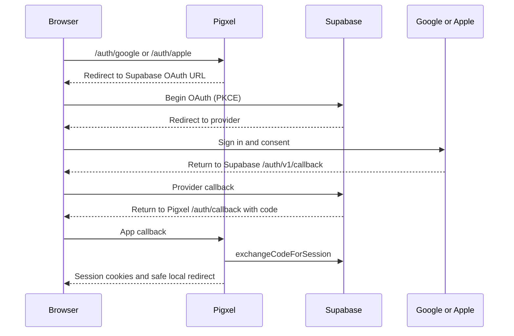

# Google and Apple sign-in for Pigxel

This guide configures the OAuth flows already implemented in Pigxel. Use hosted Supabase for the easiest Apple setup. The application-side tests use mocked providers; an actual account sign-in still needs the configuration below.

## 1. Understand the two redirects



| Configure in                                 | Callback / origin                                                                                           |
| -------------------------------------------- | ----------------------------------------------------------------------------------------------------------- |
| Google OAuth client: Authorized redirect URI | `https://<project-ref>.supabase.co/auth/v1/callback` — copy the exact provider callback shown in Supabase   |
| Apple Services ID: Return URL                | Same Supabase provider callback                                                                             |
| Apple Services ID: Domain                    | `<project-ref>.supabase.co` — or the actual configured Supabase Auth custom domain                          |
| Supabase: Site URL                           | Pigxel origin, such as `http://localhost:3000` for development or `https://your-app.example` for production |
| Supabase: Redirect URLs                      | Pigxel `/auth/callback` with the query parameters described below                                           |
| Pigxel: `APP_URL`                            | The origin of this app deployment; must match the browser origin used for sign-in                           |

The provider console gets the **Supabase** callback. Supabase's redirect allowlist gets the **Pigxel** callback. A local Pigxel app can use a hosted Supabase project, so Apple still returns to Supabase over HTTPS.

## 2. Configure Supabase and Pigxel first

In hosted Supabase, open **Authentication → URL Configuration**:

- Set Site URL to your app origin.
- For local development, add `http://localhost:3000/auth/callback` and `http://localhost:3000/auth/callback?**` to Redirect URLs. This confines the pattern to the callback while accepting provider/next query parameters.
- Add `http://localhost:3000/auth/confirm` for the existing email-token flow.
- For production, use your exact origin and callback entries matching the application. Common exact values are:

```text
https://your-app.example/auth/callback?next=%2Fhome&provider=google
https://your-app.example/auth/callback?next=%2Fhome&provider=apple
https://your-app.example/auth/callback?next=%2Fsettings%2Faccount&provider=google
https://your-app.example/auth/callback?next=%2Fsettings%2Faccount&provider=apple
https://your-app.example/auth/callback?next=/auth/update-password
https://your-app.example/auth/callback?next=/settings/account
https://your-app.example/auth/confirm
```

Drive reconnection can return to `/tiles/new` or `/tiles/edit?id=…`. If you support these variable continuations, also allow your exact origin's `/auth/callback?**` pattern. The app independently restricts `next` to approved local destinations. Do not use a wildcard across arbitrary production domains. Supabase recommends exact production redirect paths where practical. [Supabase redirect documentation](https://supabase.com/docs/guides/auth/redirect-urls).

Enable **manual identity linking** in Supabase Auth settings if users should connect Google/Apple from Account settings. Without it, login may work while linking an existing email account fails.

Set these in `apps/web/.env.local`, and in your production hosting environment when deploying:

```dotenv
NEXT_PUBLIC_SUPABASE_URL=https://<project-ref>.supabase.co
NEXT_PUBLIC_SUPABASE_PUBLISHABLE_KEY=<your-publishable-key>
APP_URL=http://localhost:3000
```

Use `https://your-app.example` for production `APP_URL`. Restart the Next.js server after changing environment variables. Apply the repository's Supabase migrations so OAuth users receive profiles and can use the rest of the app.

## 3. Create Google credentials

1. Create/select a Google Cloud project. In Google Auth Platform, configure branding, audience, and data access. During Testing, add the accounts you will test with.
2. Configure `openid`, email, and profile scopes. Add `https://www.googleapis.com/auth/drive.file` and enable Drive API only if enabling Pigxel's Drive storage.
3. Create a **Web application** OAuth client. Add Pigxel origins (development `http://localhost:3000`, plus your production origin) under Authorized JavaScript origins.
4. Add `https://<project-ref>.supabase.co/auth/v1/callback` under Authorized redirect URIs.
5. In **Supabase → Authentication → Sign In / Providers → Google**, enable Google and save the client ID and client secret.
6. Put that same client ID in Pigxel's `GOOGLE_CLIENT_ID`. Restart the app and test the Google button.

The provider secret belongs in Supabase. For basic sign-in Pigxel only needs the ID to enable its button. [Supabase Google setup](https://supabase.com/docs/guides/auth/social-login/auth-google).

### Optional Google Drive

Pigxel requests Drive access only when all required server configuration is present:

```dotenv
GOOGLE_CLIENT_ID=<same-web-client-id-as-supabase>
GOOGLE_CLIENT_SECRET=<same-web-client-secret-as-supabase>
SUPABASE_SECRET_KEY=<server-only-supabase-secret-key>
```

Apply `20260928160000_google_drive_connections.sql` (along with later migrations). When Drive is available, Google login requests offline `drive.file` access; reconnection explicitly requests consent to obtain a refresh token. Callback handling stores available Google refresh tokens server-side; the browser obtains short-lived access tokens through `/api/google-drive/token`. Returning Google authorizations may not include a fresh refresh token; use **Connect Google Drive** in Account settings when necessary.

Basic Google sign-in must work without a Supabase secret key or Drive client secret in Pigxel. Never place those secrets in `NEXT_PUBLIC_*` variables.

## 4. Configure Apple with your Developer account

1. Create an **App ID** with Sign in with Apple enabled in Apple Developer → Certificates, Identifiers & Profiles.
2. Create a **Services ID** for the website, for example `com.yourcompany.pigxel.web`. Enable Sign in with Apple and associate its primary App ID.
3. Configure its domain as `<project-ref>.supabase.co` and Return URL as `https://<project-ref>.supabase.co/auth/v1/callback` (use your actual Auth domain if customized).
4. Create a Sign in with Apple signing key; retain its `.p8` file, Key ID, and Team ID. Generate an Apple client-secret JWT using the generator in Supabase's Apple guide.
5. Enable Apple in Supabase's provider settings. Put the **Services ID first** in Client IDs and supply the generated secret.
6. Set Pigxel `APPLE_CLIENT_ID` to that Services ID, restart, and test Apple login.

Rotate the generated client secret before expiry, at most six months. The hosted Supabase dashboard holds it; Pigxel needs no Apple private key. OAuth does not supply the user's full name; users can edit their generated profile in Settings. Register your email source with Apple's relay service if sending to hidden-email users. [Supabase Apple configuration and secret generator](https://supabase.com/docs/guides/auth/social-login/auth-apple).

## 5. Using local Supabase instead

`supabase/config.toml` configures Google and has an optional Apple section. Credentials must be available to the **Supabase CLI process**; Next.js loading `apps/web/.env.local` does not make them available to the CLI. Supply `GOOGLE_CLIENT_ID` and `GOOGLE_CLIENT_SECRET` through your shell/secret manager. For local Apple, supply `APPLE_CLIENT_ID` and generated JWT `APPLE_SECRET` and enable the Apple section only after its configuration is valid.

For a Google client targeting local Supabase, the provider callback is `http://127.0.0.1:54321/auth/v1/callback`, not the app's port 3000. Register that URI in Google too. Apple browser OAuth requires suitable registered HTTPS return configuration; hosted Supabase is the recommended development path here rather than trying to register a raw localhost Apple callback.

After changing local Auth configuration, restart the local Supabase services according to your development setup. Do not accidentally point the browser client at one Supabase instance while configuring providers in another.

## 6. What the app does

- `/auth/google`: starts Google sign-in when signed out; links a new Google identity to the current account when signed in; reconnects Drive when configured. Drive permissions are omitted for basic auth-only setup.
- `/auth/apple`: starts Apple sign-in or links Apple to the current account. Already linked accounts return without requesting a second link.
- `/auth/callback`: exchanges the PKCE code, establishes the cookie session, optionally saves Google Drive access, and returns to the approved local page.
- Provider markers preserve meaningful Google/Apple error states; expired OAuth codes no longer masquerade as password-recovery failures.
- Successful authentication still works when Drive token storage fails; the return URL reports a Drive connection error.
- Account settings support linking/unlinking; removing the only identity is blocked. Apple's private relay email may differ from a Google/email identity, so do not assume those accounts automatically merge.

Core files: [Google route](../apps/web/src/app/auth/google/route.ts), [Apple route](../apps/web/src/app/auth/apple/route.ts), [callback](../apps/web/src/app/auth/callback/route.ts), [callback URL helper](../apps/web/src/lib/auth/config.ts), [cookie client](../apps/web/src/lib/supabase/server.ts).

## 7. Live verification

1. Open an incognito window at the exact origin specified by `APP_URL`; sign in with Google. Verify `/home`, session persistence after reload, a Supabase Auth user, and a profile row.
2. Sign out and repeat with Apple, including Hide My Email. Verify the generated profile can be edited.
3. Cancel each provider flow. Verify its own error on login and no authenticated access granted.
4. Sign in with an email account, connect Google/Apple from Account settings, and verify the identity is attached to the same user ID.
5. Try unlinking an account's only identity; confirm it is rejected.
6. If Drive is enabled, connect it, create/save a tile, reload, and reopen it. If Drive is absent, verify Google login does not request Drive scope.
7. Repeat on the production origin after deployment and provider allowlist changes.

These steps are manual integration checks. Unit tests cannot verify credentials, provider dashboards, consent, real browser cookies, or live callback delivery.

## 8. Troubleshooting

| Symptom                                  | Check                                                                                                                               |
| ---------------------------------------- | ----------------------------------------------------------------------------------------------------------------------------------- |
| Provider button disabled                 | Public Supabase config and `GOOGLE_CLIENT_ID` / `APPLE_CLIENT_ID`; restart app after edits                                          |
| Google `redirect_uri_mismatch`           | Google's redirect URI must equal the Supabase provider callback, not Pigxel `/auth/callback`                                        |
| Return reaches landing/home unexpectedly | Supabase allowlist matches callback query; Site URL and `APP_URL` match the intended deployment                                     |
| Apple `invalid_client`                   | Correct Services ID first; valid client-secret JWT; corresponding key/team/app association                                          |
| Apple worked then stopped                | Secret expiry/rotation and provider enablement                                                                                      |
| PKCE/code exchange fails                 | Finish login in the browser/origin where it started; preserve cookies/site data; restart the flow instead of reusing a callback URL |
| Login works but Connect fails            | Manual identity linking enabled; identity not already linked to a different account                                                 |
| Google works but Drive fails             | Drive API/scope, server client secret/admin key, migrations, refresh token, consent/connection state                                |
| Duplicate Apple and Google accounts      | Different identity emails, especially Apple private relay; link from the intended account rather than assuming email matching       |
